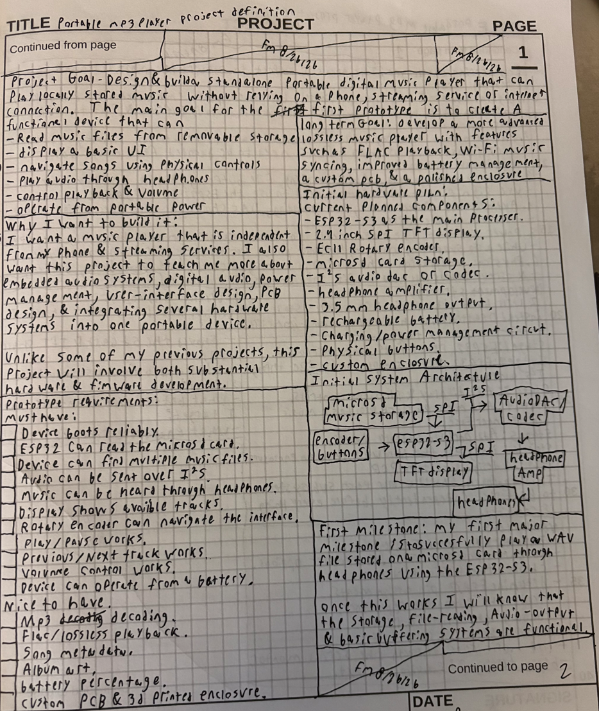
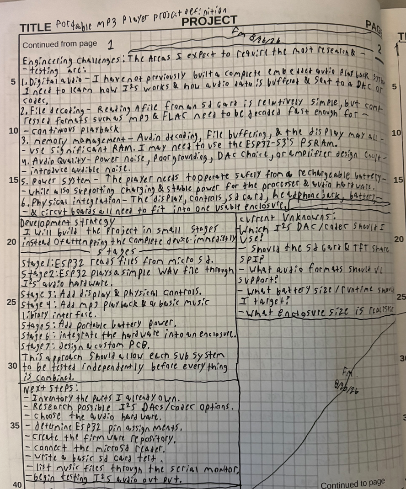

# 2026-09-07: Initial planning and system architecture

Total time spent: 2 hours

The first half of this time was spent deciding what I really wanted Amply to be. I wanted an MP3 player with a cool design that was minimalistic while retaining impressive capabilities. For this I settled on the ESP32-S3 as the main processor. I chose this for many reasons but the two main ones are its size and the fact that I have used it in the past for multiple other projects.

The second half of the time was spent planning out the main hardware I wanted Amply to use. I decided to use a microSD card to store music and other related files like cover art, a TFT display for the interface, and an encoder along with a few buttons for controlling the player. I also started looking into how I wanted to handle the audio output and battery/charging system. After that I made a basic diagram showing how I thought all of the main parts would connect to the ESP32-S3.

I also spent some time comparing a DAC and a codec. I'll go further into this in the next research session.

